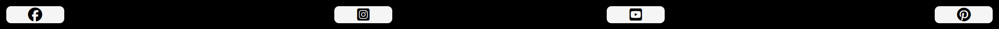
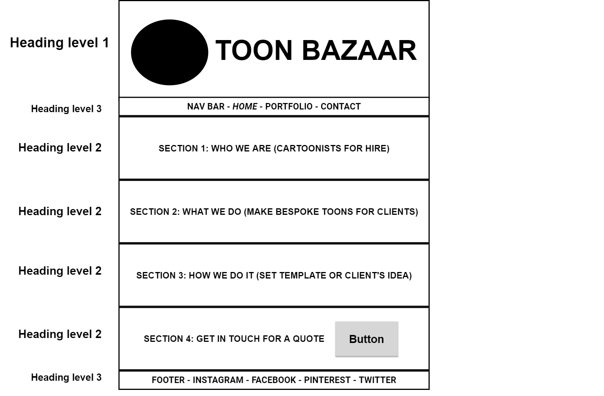
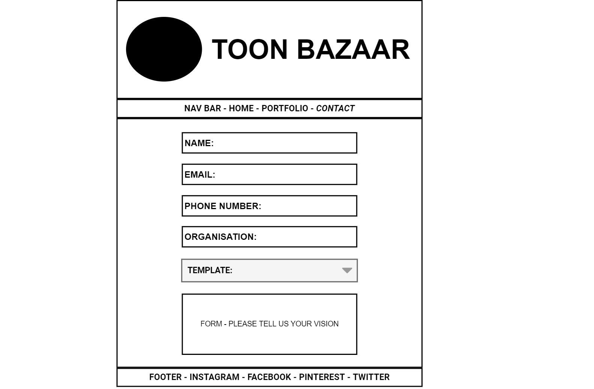

<h1 align="center" bold>Toon Bazaar Website</h1>

<h2 align="center">Milestone Project 1 - Static Front-End Website</h2>

## Live Project

[View the live project here.](https://yinyangsammy.github.io/toon-bazaar/)

## Repository

[View the repository here.](https://github.com/yinyangsammy/toon-bazaar)

## Toon Bazaar

<h3 align="center"></h3>

Toon Bazaar is a site offering bespoke cartoon, comic, illustration and animation services.

The collective of cartoonists are happy to create anything for a respective customer, from simple greeting cards and t-shirts to graphic novels or full feature animations.

This is the main marketing website for Toon Bazaar. 

It is designed to be responsive and accessible on a range of devices, making it easy to navigate for potential clients wanting to see the services on offer and hopefully make a request. Freelance artists hoping to join our community should also find the website useful for deciding whether it is somewhere they might wish to work and initiating contact with respects to applying.

# Table of Contents 

## Contents
- [User experience](#user-experience)
  * [User Stories](#user-stories)
  * [Artist Stories](#artist-stories)
- [Design](#design)
  + [Colour Scheme](#colour-scheme)
  + [Typography](#typography)
  + [Imagery](#imagery)
  + [Icons](#icons)
- [Structure](#structure)
  + [Information Architecture](#information-architecture)
  - [Irregular Structure](#irregular-structure)
- [Features](#features)
    + [Current Features](#current-features)
        + [Navigation Bar](#navigation-bar)
        + [Buttons](#buttons)
        + [Page Heading & Sub Navigations](#page-heading-and-sub-navigations)
        + [Footer](#footer)
  + [Future Features](#future-features)
- [Wireframes](#wireframes)
- [Technologies](#technologies)
  + [Languages Used](#languages)
  + [Frameworks, Libraries and Programs](#frameworks)
- [Testing](#testing)
- [Deployment](#deployment)
  + [GitHub Pages](#github-pages)
- [Credits](#credits)
  + [Code](#code)
  + [Media](#media)
  + [Content](#content)
  + [Acknowledgements](#acknowledgements)

## User Experience (UX)

-   ## User Stories

    -   ### First Time Visitor Goals

        1. As a First Time Visitor, I want to easily understand the main purpose of the site, learn more about the collective and get a feeling for who they are and what they have to offer.

        2. As a First Time Visitor, I want to be able to easily navigate throughout the site to find content.

        3. As a First Time Visitor, I want to see some samples of the artistic services they provide.

        4. As a First Time Visitor, I also want to locate their social media links to see their followings on social media to determine how trusted and known they are.

    -   ### Returning Visitor Goals

        1. As a Returning Visitor, I want to see more of the artwork they have on offer with their daily exhibits of different artists.

        2. As a Returning Visitor, I want to find the best way to get in contact with the organisation with any questions I may have or to get a quote.

        3. As a Returning Visitor, I want to find community links and links to all the artists' portfolios.

    -   ### Frequent User Goals

        1. As a Frequent User, I want to check to see if there are any newly added cartoons, comics illustrations and animations.

        2. As a Frequent User, I want to check to see if there are any new artists or any new services on offer.
        
        3. As a Frequent User, I want to sign up to the Newsletter so that I am emailed any major news, updates or offers, like the 15% off signup offer.

-   ## Artist Stories

    -   ### Artist Goals

        1. As an Artist, I want to easily understand the main purpose of the site, learn more about the collective and get a feeling for who they are and what they have to offer.

        2. As an Artist, I want to see whether my work might suit that of the Toon Bazaar collective and whether it might be a community I would like to join.

        3.  As an Artist, I want to find community links, social media links and links to all the artists' portfolios to further my knowledge and understanding of the collective.

        4. As an Artist, I want to sign up to the Newsletter so that I am emailed any major news, updates or offers, like the 15% off signup offer.

        4. As an Artist, I want to find the best way to get in contact with the organisation with any questions I may have or to get a quote.

-   ## Design

    -   ### Colour Scheme

        -   The five main colours used for Toon Bazaar are black, white, pink, purple and orange. These colours are supposed to imbue the site with a vivid and colourful comic strip feel.

    -   ### Typography

        -   I use three Google fonts throughout the website to give it a cartoon feel:

        1) "Titan One", sans-serif;
         
         -   Titan One is used for the name brand and for direct marketing messaging.
        
        2) "Jomhuria", serif;

         -   Jomhuria is used for the contact form as it is easy to read but still has a comic touch about it.

        3) "Raleway", sans-serif;

         -    Raleway is used for the longer passages as it is easy to read and is widely considered a top ten font for web development. The main about section and the nav bar both use this font.
         
    -   ### Imagery

        -   Imagery is obviously very important, seeing as the website is supposed to showcase artwork of a high enough calibre to convince users to acquire our cartooning services.

        #### Background Images
        
        - The different background images on each page are of cartoon bazaars, in line with the name of our brand, Toon Bazaar. 
        
        - Each one was AI generated, using my own artwork as a start image or prompt. 
        
        - They are designed to be colourful, fun and striking, so as to catch the user's eye and incentivise them to take a look around and hopefully acquire our services. 
        
        - The homepage background image is supposed to showcase our ability to generate fantastic 3D content.

        - The market page background image is supposed to showcase our ability to generate fantastic 2D & comic strip content.

        - The contact page background image is supposed to showcase our ability to generate fantastic childish, playful and surreal content.

        #### **Homepage**:

        - Whilst the Homepage is there to explain to the user who we are at Toon Bazaar and what it is we do, it serves a secondary purpose of showcasing some of our 3D cartoons.

        #### 3D Comic Strip

        - Atop the page, sits an eye-catching 3D comic strip, describing why potential customers might desire or need our services.

        #### About Section

        - Beneath that, as the user scrolls down, they will come across an about section.

        - This section has various of our artists rendered as 3D cartoons, surrounding a sales pitch as to who we are, where we are, the services we can provide, the guarantee we offer, links to example artwork on the Marketplace page (market.html) and links to the contact form on the Contact page (contact.html).

        #### **Market Page**:

        - The Market Page is there to showcase daily artwork by our artists, so the user can get a feel for the work we produce.
        
        - The page is divided into 4 rows, with each one demonstrating a different medium we can provide:

        #### Animations

         - This section has a row of three 3D animations. 

        #### 2D Illustrations

        - This section has a row of three artboards showcasing 2D illustrations.
       
        
        #### Comics & Storyboards

        - This section has a row of three artboards showcasing:
        
        1. The first page of a storyboard

        2. The front cover of a graphic novel

        3. A comic strip

        #### Merchandise

        - This section features a bespoke colouring-in birthday card from parents to their spoilt son wrapped around an ai generated image showcasing the differents types of merchandise we can tailor-make for a client.

        #### **Contact Page**:

        - This features a lovely, colourful background image and a contact form.

    -   ### Icons
        
        - I used icons from Font Awesome for social media links in the footer and for the email subscription offer, to improve clarity and efficiency for my users.

-   ## Structure

    -   ### Information Architecture

        - The website has 3 pages:

        1. Homepage -  Landing page with a 3D comic strip, an about us section and links to:

        * External Artist Portfolios
        * Samples of 2D Toons
        * Samples of 3D Toons
        * Samples of Animations
        * Samples of Merchandise
        * A Contact Form with SignUp discount.

         2. Market Page - A Gallery Page, showcasing daily uploads of our artists' work. These are split into 4 rows, each showcasing three artboards or videos:

        * Animations
        * 2D Illustrations
        * Comics & Storyboards
        * Merchandise

        3. Contact Page - A Form Page, whereby clients can get in touch to make inquiries, requests and get a quote. Artists can also get in touch to inquire about becoming part of the collective.

    -   ### Irregular Structure

        -   The website includes a few structural irregularities:

        #### Embedded CSS 
        
        -   Background image styling placed in the head of the HTML file    instead of including it in the CSS stylesheet. Rationale:

            I wanted a background image which would stand out to potential users as a piece of quality artwork in its own right. However I didn't want it to detract from the artists' artwork in the foreground. 
        
            Therefore I opted for a fixed static background, whereby I could scroll through artwork in the foreground with nothing moving in the background. This proved to be the easiest way to do so, with the least impact on loading performance.

        #### Flexbox & Media Queries 

        -   My Media Queries use of Flexbox css is extensive because whenever I tried to create text boxes and make them flex with the images, I encountered two problems:

            -   [i] **Space vs Size** - I couldn't fit enough text inside a box the same size as one of the about section's border images. I tried using two boxes in column formation (each one sized according to the image next to it), but then formatting the text in the two boxes to look conjoined gave me problems. I tried flex-grow, flex-shrink and flex-basis, but to no avail.

            -   [ii] **Duality vs Binary** - I needed the about section to flex with both the columns and the rows of images bordering it, but with flex I either had the option of choosing to flex the text with the row of images or the column of images, never both.
                Therefore I had to set different css rules for media queries spanning device sizes, from a tiny Galaxy Fold resolution size to a 4K monitor resolution size.

            If ever confronted with trying to build an image border around an article of text again, I will try and find an alternative and more efficient way of doing so.
    
-   ## Features

    -   ### General Features:

        -   Responsive on all device sizes.

        -   Content-packed pages, full of colourful and inspiring imagery and media including the background images.

        -   Interactive elements such as fully-controllable video iframes and internal links to different media.
        
        -   Forms to make requests or get a quote.

        -   Easy offsite navigation to social media accounts and artists' portfolios.

    -   ### Navigation Bar

        - The Homepage, Market and Contact pages feature a navigation bar, with easy access buttons to each page, allowing the user to easily navigate between them without needing to go back to the homepage.
        - The Navigation bar appears as a horizontal list of buttons on desktop and mobile.
        - The colours of the background and the text change when hovered over. This further emphasises that this is a clickable link, making for a very intuitive user experience.

    <h2 align="center"></h2>
    <h2 align="center"></h2>
            
    -   ### Buttons

        - Buttons are used for navigation, for links to social media and for the contact form.
        - Buttons change colour (both background and text) when hovered over. 
        - Button text is legible both in its normal and hover state.

    <h2 align="center"></h2>
    <h2 align="center"></h2>

    -   ### Footer

        -   The Footer remains consistent on each page.

        -   The Footer includes social media buttons.

        -   Social Media links open in a new page.

        -   Pleasant looking brand icons make each one evident to the user. 

        -   Aria-Labels have been used to make it clear to Screen Readers.

    <h2 align="center"></h2>
    <h2 align="center"></h2>

-  ## Future Features

    -   ###  Popup Infinite Slider Gallery Modal (HTML, CSS, JavaScript) 
        
        - When a user clicks on a piece of artwork (be it an image or a video) a new frame will pop up in the foreground, allowing the user to view the art in a larger frame with greater detail. Then they will be able to scroll horizontally through the different pieces of art.
        [https://www.youtube.com/watch?v=H5zTYYOX1to] | 
        [https://codinginpublic.dev/projects/popup-image-slider/]

    -   ### Onsite Artist Portfolios

        - Ideally in a future update, all the artist portfolios will be onsite and available via internal links.

    -   ### Academy Page

        - I would like to add a page with tutorials (text & video) and the ability to be tutored online by the user's artist of choice.

    -   ### 404 Page
        - I will add a colourful and friendly custom 404 error page to help the user navigate back to the Homepage if they enter an incorrect URL. I will achieve this by following the below Github documentation:
         [Github Documentation](https://docs.github.com/en/pages/getting-started-with-github-pages/creating-a-custom-404-page-for-your-github-pages-site).

## Wireframes

-   #### Home Page Wireframe - <h2 align="right"></h2> 

-   #### Market Page Wireframe - <h2 align="right"></h2> 

-   #### Contact Page Wireframe - <h2 align="right"></h2> 

## Technologies

-   ### Languages

-   [HTML5](https://en.wikipedia.org/wiki/HTML5)
-   [CSS3](https://en.wikipedia.org/wiki/Cascading_Style_Sheets)

-   ### Frameworks & Libraries & Programs

1. [Hover.css:](https://ianlunn.github.io/Hover/)
    - Hover.css was used on the Social Media icons in the footer to add the float transition while being hovered over.
2. [Google Fonts:](https://fonts.google.com/)
    - Google fonts were used to import various fonts into the style.css file, which were then used on different pages.
3. [Font Awesome:](https://fontawesome.com/)
    - Font Awesome was used on all pages throughout the website to add icons for the purpose of a more efficient UX & website aesthetics.
4. [Flexbox](https://developer.mozilla.org/en-US/docs/Learn/CSS/CSS_layout/Flexbox): 
    - Flexbox was used throughout the project to make rows and columns responsive on all devices, but in particular on the Homepage to build the border of cartoonists around the about section.
5. [Media Queries](https://developer.mozilla.org/en-US/docs/Learn/CSS/CSS_layout/Media_queries): 
    - Media Queries was used throughout the project to make the web site responsive on all devices.
6. [IFrame Player API](https://developers.google.com/youtube/iframe_api_reference): 
    - The IFrame player API was used to embed a YouTube video player on the website and control the player using JavaScript.
7. [Illustrator:](https://www.adobe.com/ie/products/illustrator.html)
    - Illustrator was used to create the vector artwork with the aid of a tablet and pen.
8. [Photoshop:](https://www.adobe.com/ie/products/photoshop.html)
    - Photoshop was used to paint, resize, retouch and edit images for the website.
9. [Balsamiq:](https://balsamiq.com/)
    - Balsamiq was used to create the [wireframes](https://github.com/) during the design process.
10. [Pencil:](https://pencil.evolus.vn/)
    - Pencil was used to create the [wireframes](https://github.com/) during the design process.
11. [CodeBeautify:](https://codebeautify.org/css-beautify-minify#)
    - CodeBeautify was used to help beautify the code.
12. [NightCafeStudio:](https://creator.nightcafe.studio/)
    - NightCafeStudio was used in tandem with my own artwork to create the backgrounds and the 3D cartoons characters.
13. [Git](https://git-scm.com/)
    - Git was used for version control by utilizing the Gitpod terminal to commit to Git and Push to GitHub.
14. [GitHub:](https://github.com/)
    - GitHub is used to store the projects code after being pushed from Git.

# Testing

The Toon Bazaar website has been tested using the following methods:
- [Code Validation](#code-validation)
    - [W3C HTML Validator](#w3c-html-validator) 
        - [Home Page](#home-page)
        - [Market Page](#exhibitions-page)
        - [Contact Page](#contact-page)
    - [W3C CSS Validator](#w3c-css-validator)
- [Lighthouse](#lighthouse)
- [Responsiveness](#responsiveness)
- [Browser Compatibility](#browser-compatibility)
- [Testing User Stories](#testing-user-stories)
- [Bugs](#bugs)
    - [Resolved](#resolved)
    - [Unresolved](#unresolved)

The W3C Markup Validator and W3C CSS Validator Services were used to validate every page of the project to ensure there were no syntax errors in the project.

-   [W3C Markup Validator](https://jigsaw.w3.org/css-validator/#validate_by_input)
-   [W3C CSS Validator](https://jigsaw.w3.org/css-validator/#validate_by_input)

# Code Validation

## W3C HTML Validator

The Toon Bazaar website passed all tests using the W3C HTML Validator tool

-   #### Home Page - <h2 align="right"></h2> 

-   #### Market Page - <h2 align="right"></h2> 

-   #### Contact Page - <h2 align="right"></h2> 

## W3C CSS Validator

The Toon Bazaar website passed all tests using the W3C CSS Validator tool
<h2 align="center"></h2>

# Lighthouse

### Lighthouse Report for Homepage (Desktop)
<h2 align="center"></h2>

### Lighthouse Report for Homepage (Mobile)
<h2 align="center"></h2>

### Lighthouse Report for Market Page (Desktop)
<h2 align="center"></h2>

### Lighthouse Report for Market Page (Mobile)
<h2 align="center"></h2>

### Lighthouse Report for Contact Page (Desktop)
<h2 align="center"></h2>

### Lighthouse Report for Contact Page (Mobile)
<h2 align="center"></h2>

I used the Lighthouse reports in Google Developer Tools to examine the pages of the website for the following:

- Performace
- Accessibility
- Best Practices 
- SEO

### For Desktop:

- Homepage scored:
    - Performace - 97
    - Accessibility -100
    - Best Practices -100
    - SEO - 100

- Market Page scored:
    - Performace - 94
    - Accessibility -100
    - Best Practices - 96
    - SEO - 100

- Contact Page scored:
    - Performace - 100
    - Accessibility -100
    - Best Practices -100
    - SEO - 100

### For Mobile:

- Homepage scored:
    - Performace - 97
    - Accessibility -100
    - Best Practices -100
    - SEO - 88

- Market Page scored:
    - Performace - 66
    - Accessibility -100
    - Best Practices - 96
    - SEO - 100

- Contact Page scored:
    - Performace - 99
    - Accessibility -100
    - Best Practices -100
    - SEO - 100

- ### Future Improvements

If I want to improve my Best Practices score for the Market Page, I need to correct the aspect ratio for the images, as per:

https://developer.chrome.com/docs/lighthouse/best-practices/image-aspect-ratio/?utm_source=lighthouse&utm_medium=devtools

I will weigh up the pros and cons at a future instance.

For Performance:

- The Home Page & Contact Page performed very well across the board, though for better SEO:

  - Text-size on the Homepage should be improved for Mobile.

- The Market Page performed not so well on Mobile and needs to be improved:

  - Lighthouse recommends the following:

  1. Removing external fonts or making them embedded.
  2. Saving images in next-gen formats. 
  3. Removing javascript iframes.
  4. Eliminating render-blocking resources to improve performance on the Market Page.

# Browser Compatibility

The site was tested in Brave, Google Chrome, Microsoft Edge and Mozilla Firefox on desktop.

The site was tested in Brave, Google Chrome and Firefox on mobile and tablet.

No issues arose during browser testing. 

Appearance, functionality and responsiveness were largely consistent across browsers and devices, adapting fluidly when changing from portrait to landscape mode.

# Responsiveness

Responsivity tests were carried out using Google Chrome DevTools & Microsoft Edge DevTools. Device screen sizes covered include:

- iPhone SE
- iPhone XR
- iPhone 12 Pro
- Pixel 5
- Samsung Galaxy S8+
- Samsung Galaxy S20 Ultra
- iPad Mini
- iPad Air
- Surface Pro 7
- Surface Duo
- Galaxy Fold
- Samsung Galaxy A51/71
- Nest Hub
- Nest Hub Max

#### Iphone 
<h2 align="center"></h2>

#### Ipad 
<h2 align="center"></h2>

#### Nest Hub Max 
<h2 align="center"></h2>

I also created custom settings for FHD (1920x1080), 2k (2560x1440) & 4K (3840 x 2160) screens to verify the web pages would work across monitor sizes. 

#### FHD (1920x1080) 
<h2 align="center"></h2>

#### 2k (2560x1440)
<h2 align="center"></h2>

#### 4K (3840 x 2160)
<h2 align="center"></h2>

-   ### Testing User Stories from User Experience (UX) Section

    -   #### First Time Visitor Goals

    1. As a First Time Visitor, I want to easily understand the main purpose of the site and learn more about the organisation.

        1. Upon entering the site, users are automatically greeted with a clean and easily readable navigation bar to go to the page of their choice. Underneath there is a Hero Image with Text and a "Learn More" Call to action button.
        2. The main points are made immediately with the hero image
        3. The user has two options, click the call to action buttons or scroll down, both of which will lead to the same place, to learn more about the organisation.

    2. As a First Time Visitor, I want to be able to easily be able to navigate throughout the site to find content.

        1. The site has been designed to be fluid and never to entrap the user. At the top of each page there is a clean navigation bar, each link describes what the page they will end up at clearly.
        2. At the bottom of the first 3 pages there is a redirection call to action to ensure the user always has somewhere to go and doesn't feel trapped as they get to the bottom of the page.
        3. On the Contact Us Page, after a form response is submitted, the page refreshes and the user is brought to the top of the page where the navigation bar is.

    3. As a First Time Visitor, I want to look for testimonials to understand what their users think of them and see if they are trusted. I also want to locate their social media links to see their following on social media to determine how trusted and known they are.
        1. Once the new visitor has read the About Us and What We Do text, they will notice the Why We are Loved So Much section.
        2. The user can also scroll to the bottom of any page on the site to locate social media links in the footer.
        3. At the bottom of the Contact Us page, the user is told underneath the form, that alternatively they can contact the organisation on social media which highlights the links to them.

-   #### Returning Visitor Goals

    1. As a Returning Visitor, I want to find the new programming challenges or hackathons.

        1. These are clearly shown in the banner message.
        2. They will be directed to a page with another hero image and call to action.

    2. As a Returning Visitor, I want to find the best way to get in contact with the organisation with any questions I may have.

        1. The navigation bar clearly highlights the "Contact Us" Page.
        2. Here they can fill out the form on the page or are told that alternatively they can message the organisation on social media.
        3. The footer contains links to the organisations Facebook, Twitter and Instagram page as well as the organization's email.
        4. Whichever link they click, it will be open up in a new tab to ensure the user can easily get back to the website.
        5. The email button is set up to automatically open up your email app and autofill there email address in the "To" section.

    3. As a Returning Visitor, I want to find the Facebook Group link so that I can join and interact with others in the community.
        1. The Facebook Page can be found at the footer of every page and will open a new tab for the user and more information can be found on the Facebook page.
        2. Alternatively, the user can scroll to the bottom of the Home page to find the Facebook Group redirect card and can easily join by clicking the "Join Now!" button which like any external link, will open in a new tab to ensure they can get back to the website easily.
        3. If the user is on the "Our Favourites" page they will also be greeted with a call to action button to invite the user to the Facebook group. The user is incentivized as they are told there is a weekly favourite product posted in the group.

-   #### Frequent User Goals

    1. As a Frequent User, I want to check to see if there are any newly added challenges or hackathons.

        1. The user would already be comfortable with the website layout and can easily click the banner message.

    2. As a Frequent User, I want to check to see if there are any new blog posts.

        1. The user would already be comfortable with the website layout and can easily click the blog link

    3. As a Frequent User, I want to sign up to the Newsletter so that I am emailed any major updates and/or changes to the website or organisation.
        1. At the bottom of every page their is a footer which content is consistent throughout all pages.
        2. To the right hand side of the footer the user can see "Subscribe to our Newsletter" and are prompted to Enter their email address.
        3. There is a "Submit" button to the right hand side of the input field which is located close to the field and can easily be distinguished.

### Further Testing

-   The Website was tested on Brave, Google Chrome, Internet Explorer, Microsoft Edge and Safari browsers.
-   The website was viewed on a variety of devices, including a desktop, a laptop & a variety of different-sized S Series Samsung phones.
-   A large amount of testing was done to ensure that all pages were linking correctly for both internal and external links.

### Resolved Bugs

### Unresolved Bugs

-   Improve Lighthouse Performance score on all pages, but particularly the Market Page by making changes including:

    - Serve images in next-gen formats (Image formats like WebP and AVIF often provide better compression than PNG or JPEG, which means faster downloads and less data consumption.)
    - Eliminate render-blocking resources (Resources are blocking the first paint of your page. Consider delivering critical JS/CSS inline and deferring all non-critical JS/styles)
    - Minify CSS

## Deployment

### GitHub Pages

The project was deployed to GitHub Pages using the following steps...

1. Log in to GitHub and locate the [GitHub Repository](https://github.com/)
2. At the top of the Repository (not top of page), locate the "Settings" Button on the menu.
    - Alternatively Click [Here](https://raw.githubusercontent.com/) for a GIF demonstrating the process starting from Step 2.
3. Scroll down the Settings page until you locate the "GitHub Pages" Section.
4. Under "Source", click the dropdown called "None" and select "Master Branch".
5. The page will automatically refresh.
6. Scroll back down through the page to locate the now published site [link](https://github.com) in the "GitHub Pages" section.

## Credits

### Code

-   [Code Institute](https://codeinstitute.net/): I referred back to tutorial videos and my notes taken throughout the process of developing this website. The navbar and footer were built in an almost identical fashion and I referred to the code from the Coders Coffee House project to create the contact form page and to the code from the Love Running project to improve my use of Media Queries.

-   [Mozilla Developer](https://developer.mozilla.org/en-US/docs/Learn/CSS/CSS_layout/Media_queries): I also had to do a little more research via Mozilla Developer to achieve the exact level of responsiveness I wanted from Media Queries.

-   [W3 Schools](https://www.w3schools.com/css/css3_gradients.asp): W3 Schools gave me the knowledge to create backgrounds featuring different gradients of colour.

-   [W3 Docs](https://www.w3docs.com/snippets/html/how-to-create-an-anchor-link-to-jump-to-a-specific-part-of-a-page.html): W3 Docs gave me the knowledge to link to a specific section of the same page or another page.

-   [Google's IFrame Player API](https://developers.google.com/youtube/iframe_api_reference): It was through Google's own page that I learnt how to insert and resize their IFrame Player API.

-   [Free Code Camp](https://www.freecodecamp.org/news/git-revert-commit-how-to-undo-the-last-commit/): Free Code Camp gave me the knowledge to reset or revert the changes of a recent git commit.

-   [W3 Schools](https://www.w3schools.com/css/css3_gradients.asp): W3 Schools gave me the knowledge to create backgrounds featuring different gradients of colour.

-   [Stack Overflow](https://stackoverflow.com/questions/12991351/how-to-force-image-resize-and-keep-aspect-ratio): Stack Overflow gave me the knowledge to force an image to resize but retain the aspect ratio?

-   [CSS-TRICKS](https://css-tricks.com/almanac/properties/t/text-underline-position/): CSS-TRICKS gave me the knowledge to set the placement of the underline so it wasn't broken by the text when using the Jomhuria font.

### Content

-   All content was created and written by the developer.

### Media

-   All Images were created by the developer, either by hand or via the AI image generator NightCafe Studio (https://creator.nightcafe.studio/).

- All Animations are placeholders, kindly provided free of charge and free of copyright by BEEPLE (https://www.beeple-crap.com/).
<h2 align="center"></h2> 

### Acknowledgements

-   My Academic Supervisor and Lecturer, Rachel Furlong, for the great lessons, encouragement, kind guidance, helpful feedback and recommended tools.

-   My Mentor, Excellence Ilesanmi, for all the kind advice, encouragement,helpful feedback and recommended tools.

-   Thank you to my classmates at EKCG for all their tips and guidance.

-   Thank you to the tutors and staff at Code Institute for all their support.

Toon Bazaar is purely for the sake of the developer's portfolio, though it might be further developed into a commercial website at some point in the future.

<h4 align="center">yinyangsammy 2024</h4>